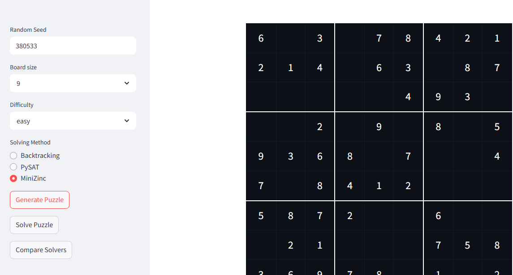
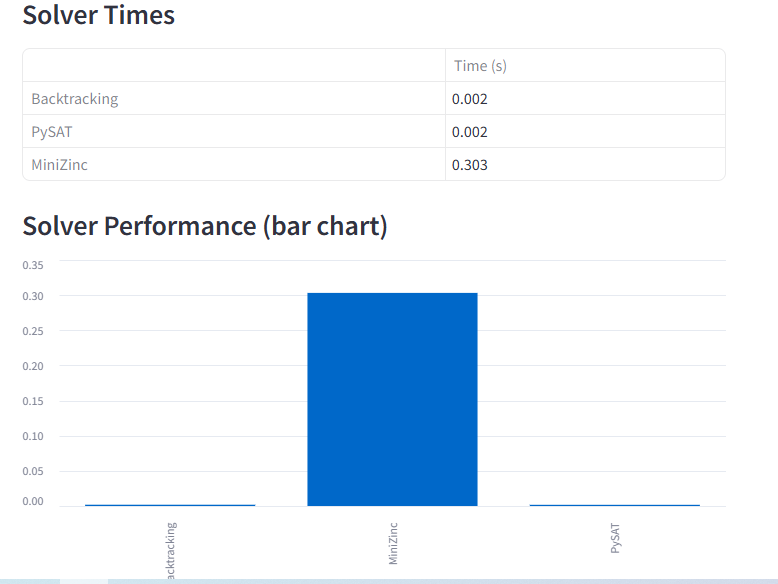
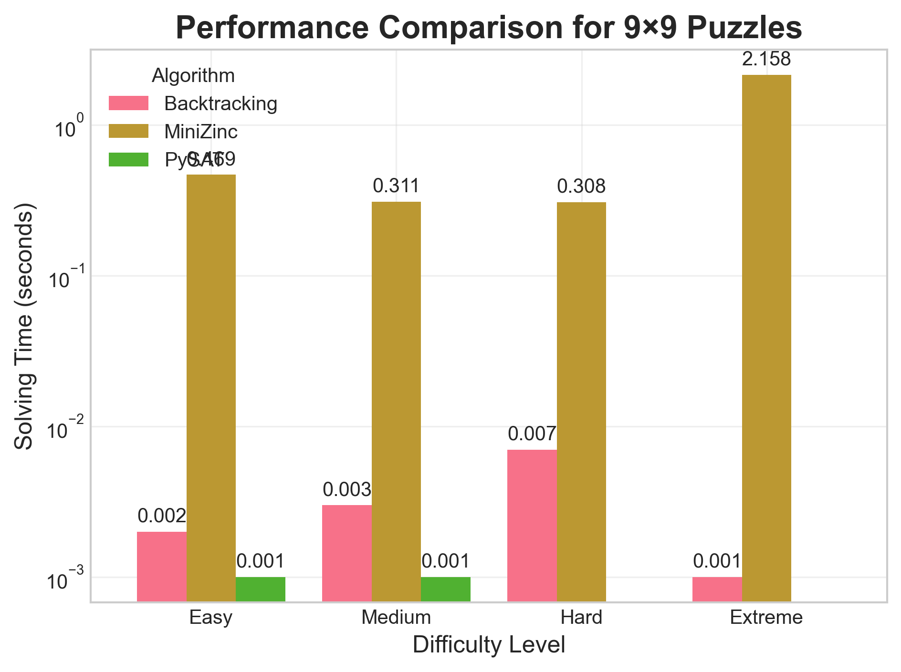
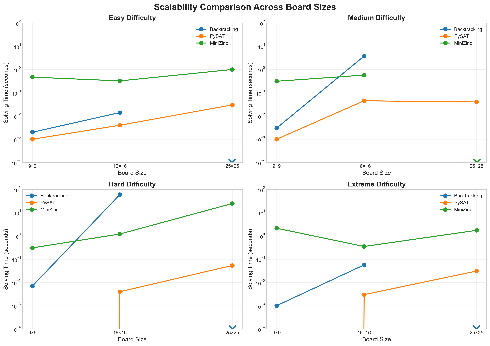
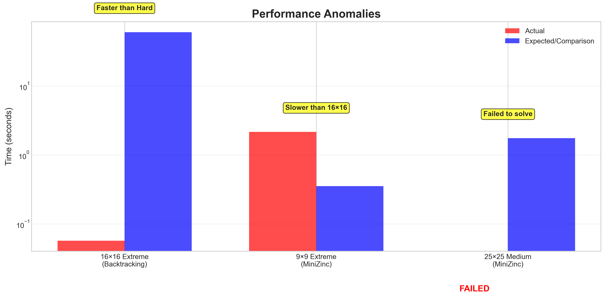
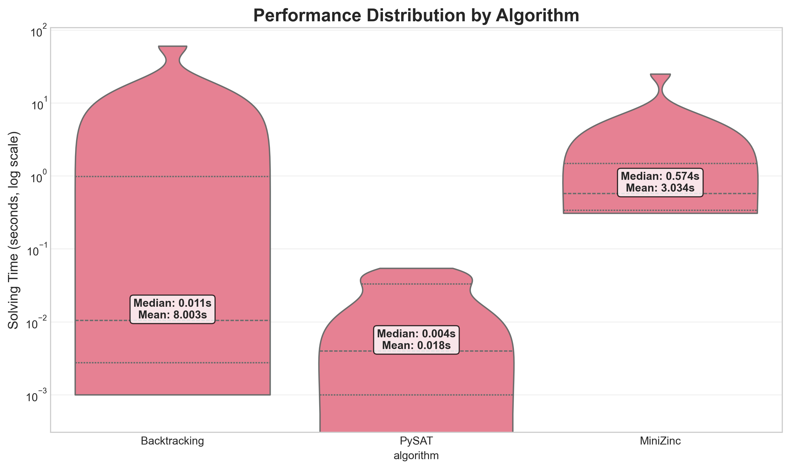
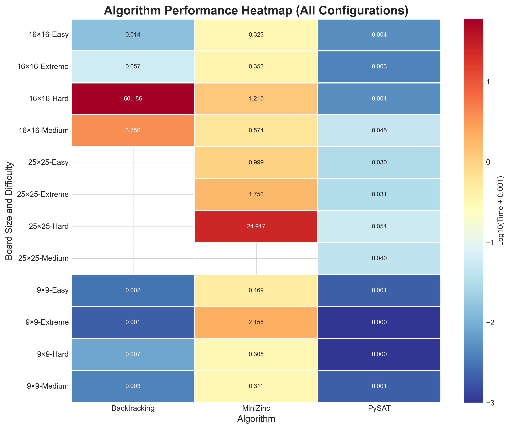

# Sudoku Solver – Constraint Satisfaction Performance Analysis

## Overview
This project was developed as part of my final-year dissertation and investigates Sudoku as a benchmark problem for constraint satisfaction problems (CSPs). The project compares different solving approaches to evaluate how performance changes with puzzle size and difficulty.

## Key Skills
- Constraint Satisfaction Problems (CSPs) analysis
- Algorithm design: Backtracking, MRV heuristic
- SAT-solving using PySAT (Glucose3)
- Constraint Programming with MiniZinc
- Python programming: Pandas, Matplotlib, Seaborn, subprocess, tempfile, json
- Web app development: Streamlit
- Data visualization and performance analysis
- Problem-solving and computational efficiency evaluation

## Solving Approaches
- Backtracking with Minimum Remaining Values (MRV) heuristic
- SAT-based solving using PySAT (Glucose3)
- Constraint Programming using MiniZinc

## Experimental Scope
The solvers were evaluated across:
- Puzzle sizes: 9×9, 16×16, and 25×25
- Difficulty levels: easy, medium, hard, and extreme

Performance metrics included solving time and success rate.

### Dissertation
- [Final Year Dissertation PDF](docs/dissertation.pdf)

### Screenshots

This project includes screenshots of both the application interface and results **generated automatically by code** during execution (using Python libraries such as Matplotlib, Seaborn, and Pandas).

#### Application Interface
These screenshots show the Sudoku app and actual results from running the solvers:

- App interface: 
- Generated results in app: 
- Random Sudoku puzzle generator: 

#### Generated Results
These results are **produced automatically by code** during execution and include performance visualizations, distributions, heatmaps, and anomaly detection:

- 9×9 puzzle performance: 
- Scalability comparison: 
- Anomalies detected: 
- Distribution plot: 
- Heatmap visualization: 

## Technologies & Key Skills
- Python (Pandas, Matplotlib, Seaborn, subprocess, tempfile, json)
- PySAT (Glucose3)
- MiniZinc
- Streamlit
- Constraint Satisfaction Problems (CSPs)
- Algorithm design: Backtracking, MRV heuristic
- Data visualization and performance analysis
- Application interface development

## How to Run
1. Install dependencies:
   pip install -r requirements.txt
2. Run the application:
   streamlit run app.py

